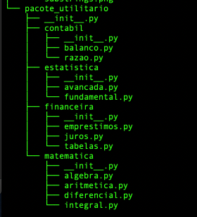

# Aula 13

## Pacotes

De uma forma bem simples, um pacote é uma coleção de módulos.
Quando os módulos tornam-se muito grandes o ideal é subdividi-lo em vários módulos e depois agrupar os módulos em um determinado pacote. O ideal é planejar o pacote para conter módulos que tratam de assuntos similares.

Os pacotes servem também para evitar a chamada colisão de nomes, isto é, quando você tem dois módulos com o mesmo nome mas que, na verdade, executam de forma diferente. Então o ideal é invocar um módulo na forma de `pacote.modulo` ou `pacote.modulo.funcao`. 

Enquanto os módulos são estruturados em arquivos, conforme visto na aula 12, os pacotes são estruturados em pastas. Todos os pacotes devem, obrigatoriamente, conter um arquivo denominado `__init__.py`. Esses arquivos são necessários para informar o interprestador que uma deeterminada pasta é um pacote de módulos. Em alguns casos, os arquivos `__init.py__` são simplesmente arquivos vazios, em outros, porém, esses arquivos contém um variável denominada `__all__` que é uma lista contendo os módulos daquele pacote.

Para você entender melhor o conceito de pacotes, vamos ver tudo isso na prática:

Crie uma estrutura de diretórios conforme a Figura 1.

  

   <strong>Figura 1-Árvore de Pacotes</strong> 

