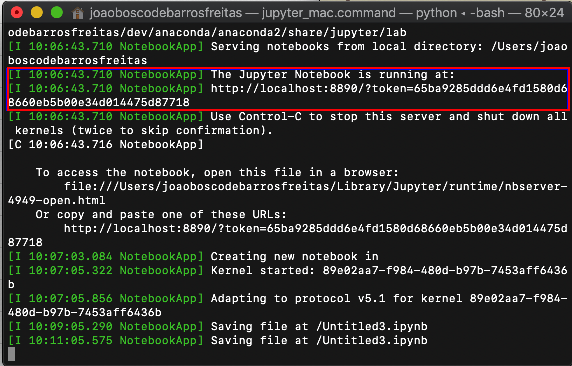
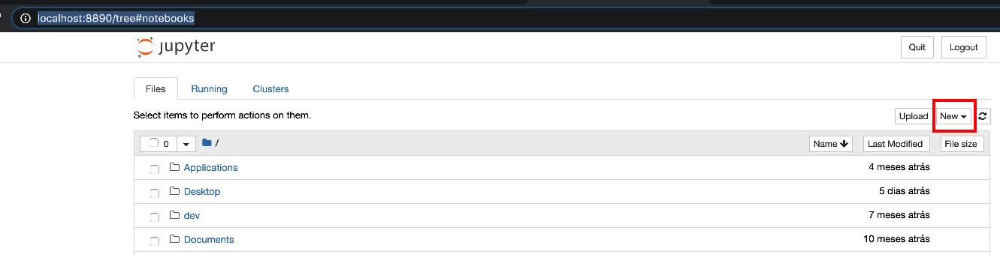
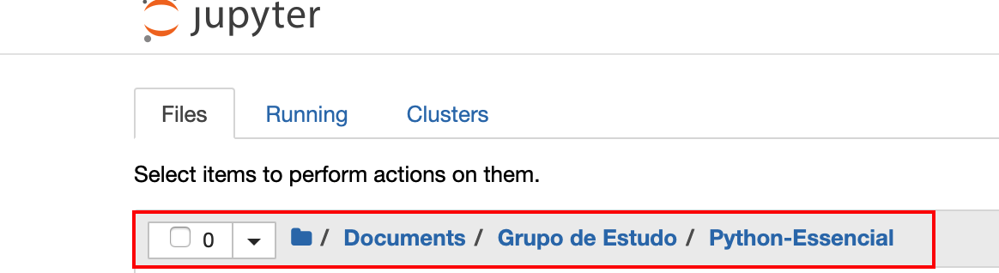
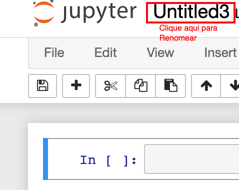

# Aula 2

## Inicianto o Jupyter Notebook

1. Execute o Anaconda;
2. Clique no botão `Launch`, conforme mostrado na Figura 1

  

   <strong>Figura 1-Executando o Jupyter Notebook</strong> 

3. Se o navegador NÃO abrir automaticamente, faça o seguinte:

    - Selecione a janela do prompt, shell ou terminal de acordo com o seu SO;
    - Verique qual o número da porta utilizada pelo JupyterNotebook, conforme Figura 2. No meu caso ele está usando a porta 8890;
    - Abra o navegador e digite `http://localhost:numero_da_porta`   

  

   <strong>Figura 2-Verificando a porta utilizada pelo Jupyter</strong> 

4. Deverá aparecer uma janela parecida com a da Figura 3

  

   <strong>Figura 3-A Janela do Jupyter</strong> 

5. Selecione a pasta criada por você e inicializada com o git na Aula 1,  Figura 4;

  

   <strong>Figura 4-Selecionando uma pasta de trabalho</strong> 

6. Clique no botão `New`, conforme Figura 3

7. Renomeie o novo Notebook para `Aula2`, clicando na barra de títulos, conforme Figura 5

  

   <strong>Figura 5-Renomeando um Notebook</strong> 

8. Pronto. Criamos nosso primeiro notebook. Agora é só começar a brincadeira!