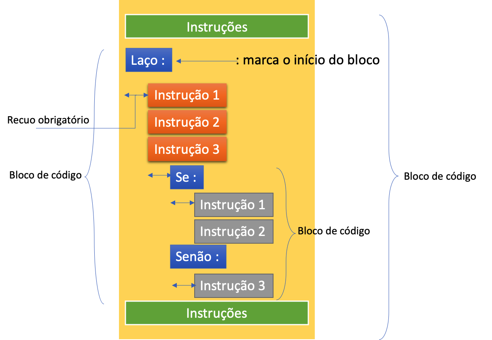

# Aula 3

## Sintaxe do Python

Nos próximos itens vamos mostrar os fundamentos da linguagem Python. Assim como o futebol tem seus fundamentos: cabecear, matar no peito, chute de 3 dedos etc, a linguagem Python, como qualquer outra linguagem de programação, tem sua própria maneira (sintaxe) de escrever as instruções fundamentais, ou simplesmente, os fundamentos.

Então vamos lá.

1. Continuação de linhas

Uma boa prática de programação é escrever linhas com a largura máxima de 80 colunas. Isso melhora a legibilidade do seu código e evita que o leitor tenha que ficar rolando a tela para direita e para a esquerda o tempo todo. 

Para evitar linhas muito longas o ideal é quebrá-las em 2 ou 3 linhas. Entretanto, quando vc quebra uma linha você tem que informar ao Python que a próxima linha é uma continuação da linha atual. Como fazer isso? 

Bem para informar isso você deve usar o caractere de barra invertida `\` ao final da linha ou parênteses, colchetes ou chaves, em expressões que utilizam tais caracteres.

- Exemplo 1 - Continuação usando barra invertida:

```python 
#Exemplo-1
a="Python é uma linguagem interpretada e "\
  "muito poderosa!"
   
print a    

```

```
Python é uma linguagem interpretada e muito poderosa!
```

- Exemplo 2 - Continuação usando colchete e parênteses:

```python 
#Exemplo-2
a = [1,2,3,4]+[
    10,20,30]

b= (3+2)*(
    8+2)
print "A variável 'a' é o resultado da soma de duas listas e vale {}".format(a)
print "A variável 'b' é o resultado de uma expressão e vale {}".format(b)
```

```
A variável 'a' é o resultado da soma de duas listas e vale [1, 2, 3, 4, 10, 20, 30]
A variável 'b' é o resultado de uma expressão e vale 50
```
Ficou claro? 
Resumindo: 
 - Via de regra utilize o caractere `\` para indicar que uma linha continua na linha seguinte.
 - Se ao final da linha houver uma caractere `[`, `(` ou  `{`, não precisa usar o `\`.

2. Comentários

Em toda linguagem de programação os comentários servem para documentar o que está sendo realizado.
Há duas formas de fazer comentário em Python

- Comentário de linha usando `#`

- Comentário de múltiplas linhas Usando `'''`   `'''`

- Exemplo 3 - Comentário de uma única linha

```python 
#Exemplo-3 - Comentário de uma única linha
#Vamos fazer uma iteração em uma lista
lista = [1,2,3,4,5] #Uma lista de números inteiros
for x in lista:
    print x
```

```
1
2
3
4
5
```

```python
#Exemplo-4 - Comentário de múltiplas linhas
'''
Este é um comentário de múltiplas linhas
Serve para documentar a rotina
Estas linhas serão ignoradas pelo interpretador
'''

```

3. Comentários Funcionais

Comentários funcionais geralmente são usados para:
- alterar a codificação do arquivo fonte do programa acrescentando um comentário
com o texto “#-*- coding: <encoding> -*#-” no inicio do arquivo, aonde <encoding> é a codificação do arquivo (geralmente latin1 ou utf-8). Alterar a codificação é necessário para suportar caracteres que não fazem parte da linguagem inglesa, no código fonte do programa.
- definir o interpretador que será utilizado para rodar o programa em sistemas UNIX, através de um comentário começando com “#!” no inicio do arquivo, que indica o caminho para o interpretador (geralmente a linha de comentário será algo como “#!/usr/bin/env python”).

Exemplo de comentários funcionais:

```python
#Exemplo-5 - Comentários funcionais

#!/usr/bin/env python 
# -*- coding: latin1 -*-
# Uma chamada de função (quebrada por vírgula)
c = range(1, 
          11)
print c
```

4. Blocos de código

<p align="center">
  
</p>
<p align="center">
   <strong>Figura 1-Blocos de Código</strong> 
</p>

Conforme você pode observar na Figura 1, o sinal de `:` determina o ínicio de um bloco. As instruções que estão dentro de um bloco devem, obrigatoriamente, estar recuadas (com tab).
Para aninhar um bloco dentro de outro bloco, basta fazer novo recuo. 

Vamos mostrar isso com um exemplo.

```python
#Exemplo-6 - Blocos de código
# Para i na lista 30, 60, 90, 120, 171:
for i in [30, 60, 90, 120, 172]:
# Se o resto dividindo por 3 for igual a zero:
    if i % 3 == 0: # Imprime...
        print i, '/ 3 =', i / 3
    else:
        print i,'Não é divisível por 3'
```
Por hoje é só. Até a [Próxima Aula](Aula4.md)