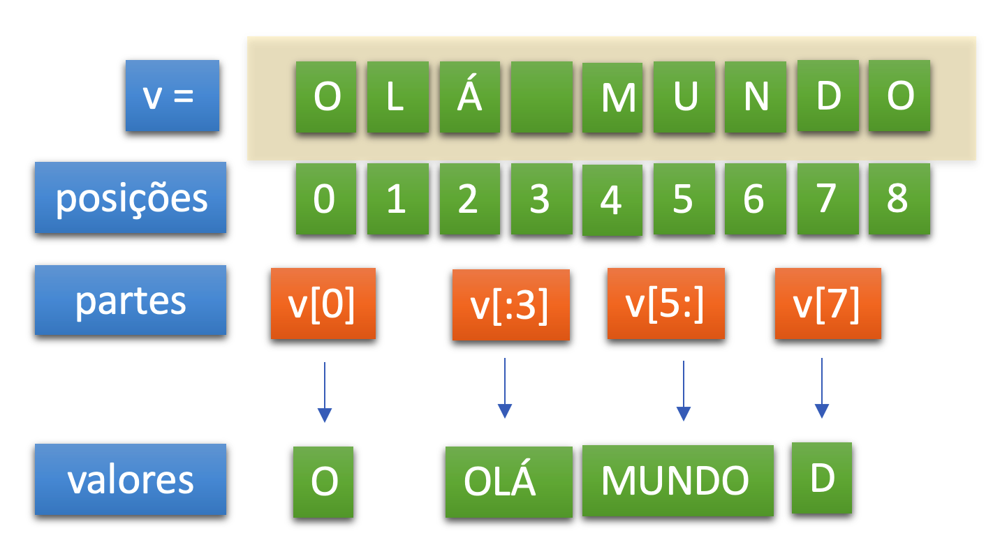

# Aula 7

## Aprendendo um pouco mais sobre o tipo Texto

Os textos no Python são tratados como `string`.

Uma `string` é qualquer sequência de caracteres. Um caractere é a menor unidade de todo o texto. Os caracateres são classificados em 3 grupos: numérico, letras do alfabeto e caracteres especiais.
As `strings` no Python são imutáveis, isto é, após criada,  não é possível adicionar, remover ou mesmo modificar algum dos seus caracteres. Para realizar essas operações, o Python precisa criar um nova `string`.

### 1. Exemplo de strings:

```python
#Exemplo 22-Strings
animal = 'Camelo'
print 'O ' + animal + ' pode ficar até 8 dias sem beber água!' # Concatenação
print 'A variável "%s" tem %d caracteres' % (animal, len(animal)) # Interpolação

for um_char in animal: print um_char # String tratada como seqüência

if animal.startswith('C'): print animal.upper() # Strings são objetos
print 3 * animal  # Pode isso ? Pode!

```
Veja os resultados:

```
O Camelo pode ficar até 8 dias sem beber água!
A variável "Camelo" tem 6 caracteres
C
a
m
e
l
o
CAMELO
CameloCameloCamelo
```


Símbolos usados na interpolação:
- %s: string.
- %d: inteiro.
- %f: real.

```python
#Exemplo 23-formatando com %
print("%s %s" %('Olá','Mundo'))

#Exemplo 24-formatando com % 
name = 'Mundo'
program ='Python'
print('Olá %s! Este é o %s.'%(name,program))

#Exemplo 25-str.format
name = 'Mundo' 
program ='Python'
print('Olá {}! Este é o {}.'.format(name, program))


#Exemplo 26-format com substituição de variáveis
name = 'Mundo' 
program ='Python'
print('Olá {nome}! Este é o {linguagem}.'.format(linguagem=program,nome=name))


#Exemplo 27-Novidade no Python 3.6  - Interpolação usando o f
name = 'World'
program = 'Python'
print(f'Hello {name}! This is {program}')

```

::: :pushpin: Importante :::

- O uso do % é uma forma antiga de fazer  interpolação e seu uso é desaconselhado pois a legibilidade do código fica compremetida.
- No método str.format() nós passamos o objeto string para a função format para a interpolação da string
- A interpolação via substituição de variáveis é muito poderosa e favorece a legibilidade do código.

### 2. Dividindo strings:

Observe a Figura 1, ela é uma representação esquemática de como as strings são armazenadas e como podem ser extraídas as partes dessa string.

<p align="center">
  
</p>
<p align="center">
   <strong>Figura 1-Dividindo string em pedaços</strong> 
</p>

Na verdade as strings são como uma array que começa na posição 0.
Você pode, então, obter um ou mais caracteres dessa string, informando o elemento do array.

Nesse sentido v[0]='O' e v[7]='D'.
Mas Python vai além, se você usar o caractere ":" pode determinar o início ou o fim do recorte da string. Por exemplo:

v[:3] irá mostrar 'Olá'. Isso por que quando escrevemos v[:3] estamos informando ao Python que desejamos 3 caracteres a partir do início. 

v[5:] irá mostrar 'Mundo' por que estamos pedindo ao Python 5 caracteres, contados do fim para o começo.

v[-1] irá mostrar 'o' por que estamos pedindo o último caractere.

::: :pushpin: Resumo :::

- Nesta aula nós começamos a entender um poderoso recurso da linguagem Python: am manipulação de textos
- Aprendemos como manipuar textos usando: concatenação, interpolação, extração de caracteres
- Aprendemos que as Strings são imutáveis e que são armazenadas como arrays
- Por fim aprendemos com extrair substrings usando os índices dos arrays e o sinal de `:`


Por hoje é só. Na [Aula 8](Aula8.md) você vai aprender um pouco mais sobre as coleções no Python. Até mais!

