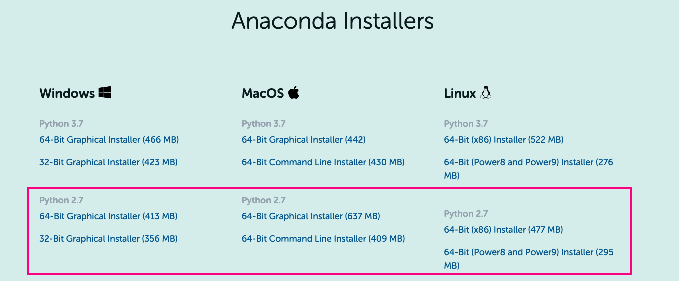
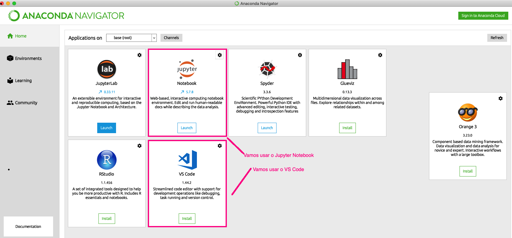

# Python-Essencial

Este repositório tem por finalidade ensinar o essencial da linguagem python.

Python é uma linguagem código aberto, permitindo que o Python seja incorporados em produtos proprietários) e a especificação da linguagem é mantida pela Python Software Foundation2 (PSF).
Python é muito utilizado como linguagem script em vários softwares, permitindo automatizar tarefas e adicionar novas funcionalidades, entre eles: BrOffice.org, PostgreSQL, Blender e GIMP. 
Python é particularmente importante para a Ciência de Dados (Data Science) por que existem diversas bibliotecas gratuitas que ajudam nesse processo tais como  NumPy, Pandas, Seaborn , Matplotlib , Plotly , Scikit-Learn , Machine Learning, Tensorflow , e muito mais!

Saiba mais sobre o uso do [Python em Data Science](http://www.cienciaedados.com/usando-python-em-data-science/)

## Antes de começar, vamos preparar o ambiente de trabalho

1. Crie uma pasta chamada `Python-Essencial` e inicie o Git nessa pasta

2. Baixe o Anaconda (Gerenciador de Pacotes para aplicações Python) de acordo com o seu sistema operacionalÀs. Atenção: para falarmos a mesma linguagem baixe a versão 2.7 do Python. Para baixar clique [aqui](https://www.anaconda.com/products/individual)

  

   <strong>Figura 1-Instalação do Anaconda</strong> 

3. Testando o ambiente
Se você instalou corretamente o Anaconda inicie o Anaconda Navigator, e uma janela semelhante a da Figura 2 deverá aparecer para você.

  

   <strong>Figura 2-Anaconda Navigator</strong> 

